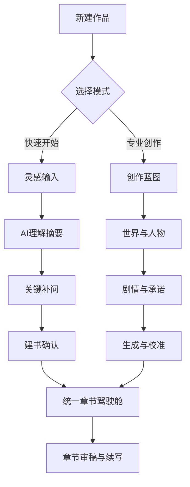

# 信息架构与用户旅程

## 1. 设计原则

- 新手优先：默认路径必须“看得懂、答得上、能完成”。
- 进阶不受限：高级用户可以逐步打开控制层。
- 单一内核：所有模式最终写入同一套基础文件与章节链路。

## 2. 全局导航重构

建议导航（按创作旅程组织）：
- 我的作品
- 新建作品
- 章节写作
- 作品设定
- 质量检查
- 市场参考
- 配置中心

## 3. 新建作品：双模式入口

页面：`/books/new`

模块：
- 模式卡片：快速开始、专业创作
- 模式说明：适用人群、预计耗时、输出结果
- 最近模板：最近使用的创作模板

行为：
- 选择后进入对应流程
- 可随时从快速模式切换到专业模式

## 4. 快速开始模式（新手路径）

### 页面 A：灵感输入

目标：让用户用自然语言表达创作意图。

模块：
- 大文本输入框（主输入）
- 辅助提示 chips（世界/人物/冲突/结局）
- 平台选择（可选）
- 风格倾向选择（可选）

输出：
- `raw_brief` 文本

### 页面 B：AI 理解摘要

目标：把自然语言转为可执行摘要。

模块：
- 作品定位卡
- 主角卡
- 世界规则卡
- 冲突与结局卡
- 风格与禁区卡

操作：
- 编辑字段
- 重新整理
- 补充一句说明

输出：
- `normalized_brief`

### 页面 C：关键补问（动态）

目标：只补最缺失的关键信息。

规则：
- 最多 5 个问题
- 每次 1 个问题
- 支持跳过（系统给默认值）

输出：
- `completed_brief`

### 页面 D：建书确认

目标：确认后才真正创建。

模块：
- 书籍基础设置
- 创作摘要终稿
- 预生成文件清单

按钮：
- 确认创建
- 回去修改
- 切换专业模式

## 5. 专业创作模式（进阶路径）

### 页面 A：创作蓝图

模块：
- 书名/副标题
- 核心题材组合
- 一句话定位
- 平台与受众
- 风格要求与禁区

### 页面 B：世界与人物

模块：
- 世界规则（背景/制度/能力边界）
- 主角结构（秘密/欲望/代价）
- 关键角色（关系与张力）
- 隐秘信息层级（可揭露时机）

### 页面 C：剧情与承诺

模块：
- 梗概
- 开篇抓手
- 第一卷主线
- 中期反转
- 长线悬念
- 结局方向

### 页面 D：生成与校准

模块：
- `author_intent` 预览
- `current_focus` 预览
- `story_bible` 预览
- `volume_outline` 预览
- `book_rules` 预览

操作：
- 确认 / 重写 / 编辑 / 锁定

## 6. 统一章节驾驶舱

无论从简单或高级模式进入，章节页面统一。

页面：`/books/:id/workbench`

三区布局：
- 左：作品状态（最近章节、未兑现钩子、人物状态）
- 中：本章目标（推进线/禁区/情绪目标）
- 右：生成控制（稳健/悬疑/细腻/节奏/暧昧）

下方结果区：
- 草稿正文
- 审核结果
- 连续性提示
- 下一章建议

## 7. 用户旅程图（Mermaid）

## 8. 页面状态定义

- `draft`：用户填写中
- `reviewing`：AI 整理中
- `ready`：可确认
- `creating`：后端建书中
- `failed`：失败可重试
- `completed`：成功进入作品

## 9. 信息密度控制策略

- 默认折叠高级字段
- 所有术语提供“人话解释”
- 输入最少化：优先自然语言 + 智能补问
- 高级功能仅在专业模式默认展开

## 10. 关键交互细则

- 离开页面提醒未保存内容
- 长文本输入自动保存草稿
- AI 整理必须支持“保留原文对照”
- 每次 AI 重整都保留版本快照

## 11. 跨设备旅程补充（新增）

跨设备核心旅程：
1. 手机端发起灵感建书。
2. 桌面端继续完成专业校准。
3. 平板/手机端查看审稿并二次生成。
4. 多端保持同一项目状态。

关键页面补充：
- 设备会话状态页（最近同步时间、冲突提示）。
- 离线草稿恢复页（弱网/断网后恢复）。

## 12. Agent 运维旅程补充（新增）

针对“开发对象为 Agent”的操作流：
1. 人类定义任务 spec。
2. Agent 执行开发与测试。
3. 人类审核高风险改动。
4. 自动发布到目标端（Web/iOS/Android/Windows/macOS）。
