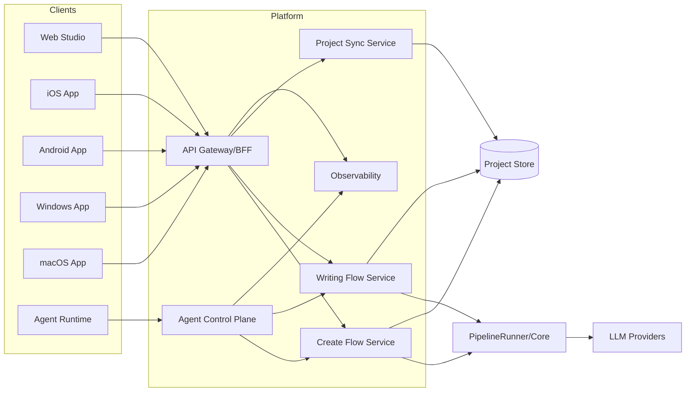

# 系统架构设计（跨端 + Agent-First）

## 1. 架构目标

支持四类终端与两类开发主体：
- 终端：iOS / Android / Windows / macOS（Web 继续保留）
- 开发主体：Agent 为主、人类工程师为守门

同时保持与当前 monorepo 的演进兼容，不推倒重来。

## 2. 目标架构总览

## 3. 技术分层

## 3.1 客户端层

- Web：保留 `packages/studio`
- Mobile：建议 React Native（Expo）复用 TypeScript 能力
- Desktop：建议 Tauri 或 Electron（按团队能力二选一）

核心原则：
- 终端差异在壳层，业务流程在共享 API/SDK。

## 3.2 平台层

- `BFF/API Gateway`：统一鉴权、限流、路由、错误码
- `Create Flow Service`：双模式建书与 brief 处理
- `Writing Flow Service`：计划、写作、审稿、修订
- `Project Sync Service`：跨设备状态同步与冲突处理
- `Agent Control Plane`：面向 Agent 的任务执行接口

## 3.3 引擎层

- 继续复用 `PipelineRunner` 和 Agents。
- 通过服务层注入上下文与模型策略。

## 4. 存储与同步策略

从“纯本地文件”升级为“本地缓存 + 云端项目存储（可选）”：

- 本地：
  - 快速编辑缓存
  - 离线草稿

- 云端：
  - 项目主状态
  - 章节与设定文件
  - brief 版本历史

同步策略：
- 默认最后写入优先（LWW）
- 对关键文件（如 `story_bible`）支持冲突提示与人工合并

## 5. Agent-First 架构要求

### 5.1 标准任务输入

Agent 接口必须接收结构化任务：
- `task_id`
- `goal`
- `scope`
- `acceptance_criteria`
- `constraints`

### 5.2 标准任务输出

- 变更文件列表
- 测试结果
- 风险说明
- 回滚建议

### 5.3 安全与审计

- Agent 仅通过受控 API 触发高风险动作
- 所有 Agent 执行保留审计轨迹

## 6. 中英文能力架构

- 项目级默认语言：`project.language`
- 书籍级主语言：`book.language`
- 章节级可覆盖（可选）

流程要求：
- brief 规范化要感知语言
- plan/compose/audit/revise 全链路语言一致
- UI 文案与内容语言解耦

## 7. 分发与上架架构

### 7.1 iOS/Android

- 使用统一 API 服务
- 账号系统与项目同步服务必须稳定
- 提供隐私、条款、数据删除能力

### 7.2 Windows/macOS

- 桌面应用可内置 Web 视图与本地文件能力
- 支持导入/导出与离线缓存

## 8. 演进路线（架构视角）

1. `Stage-A`：现有 Studio 增强（双模式 + brief）
2. `Stage-B`：引入 BFF 与同步服务
3. `Stage-C`：移动端与桌面端外壳上线
4. `Stage-D`：Agent Control Plane 标准化

## 9. 兼容策略

- 保留当前 `/api/books/create` 作为兼容入口。
- 新流程走 `/api/v2/...`。
- feature flag 控制按端逐步切流。

## 10. 风险与缓解

- 风险：跨端体验碎片化  
缓解：统一设计系统 + 共享业务 SDK。

- 风险：同步冲突导致数据不一致  
缓解：关键文件冲突提示 + 版本快照。

- 风险：Agent 误操作  
缓解：高风险操作人工审批与保护开关。

