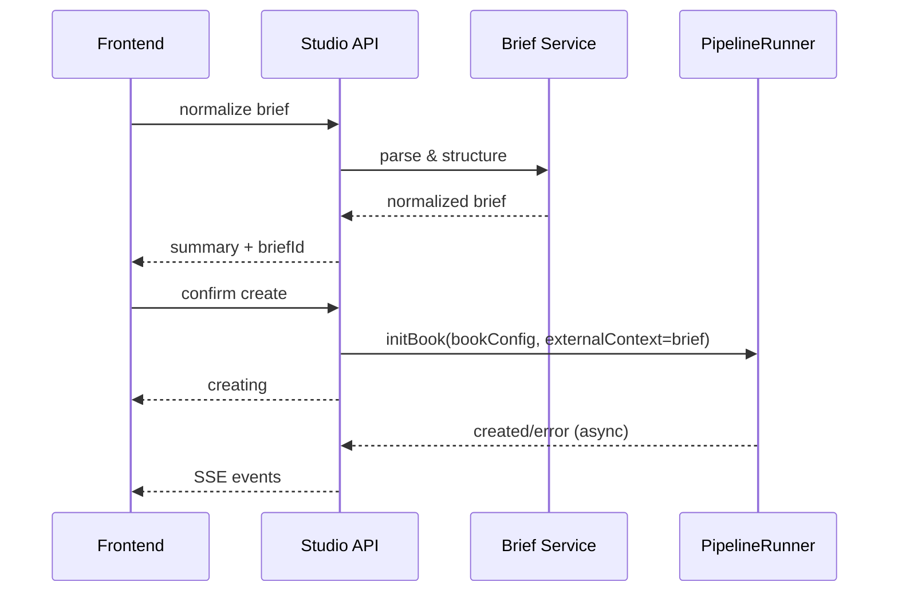

# 后端详细设计（Studio API + Core 集成）

## 1. 目标

在现有 `packages/studio/src/api/server.ts` 基础上扩展双模式建书能力，不破坏现有接口稳定性。

## 2. 模块拆分

建议新增：
- `api/services/brief-service.ts`
- `api/services/create-flow-service.ts`
- `api/schemas/brief-schema.ts`
- `api/schemas/create-flow-schema.ts`

现有复用：
- `api/book-create.ts`（可迁移部分通用函数）
- `api/errors.ts`
- `api/lib/run-store.ts`
- `api/lib/sse.ts`

## 3. API 设计（新增）

## 3.1 POST `/api/books/create/brief/normalize`

用途：把用户原始输入整理为结构化 brief。

请求：
```json
{
  "mode": "simple",
  "title": "意识残留协议",
  "rawInput": "用户自然语言输入全文",
  "platform": "tomato",
  "language": "zh"
}
```

响应：
```json
{
  "briefId": "brief_xxx",
  "normalizedBrief": {
    "title": "意识残留协议",
    "coreGenres": ["近未来科幻", "意识伦理", "社会派悬疑", "存在主义"],
    "positioning": "科技不炫技，人性不狗血...",
    "worldSetting": "...",
    "protagonist": "...",
    "mainConflict": "...",
    "endingDirection": "...",
    "styleRules": ["克制", "后劲强"],
    "forbiddenPatterns": ["狗血反转", "AI味台词"]
  }
}
```

## 3.2 POST `/api/books/create/brief/questions`

用途：返回缺失信息补问。

请求：
```json
{
  "briefId": "brief_xxx",
  "normalizedBrief": {}
}
```

响应：
```json
{
  "questions": [
    {
      "id": "protagonist_secret",
      "question": "主角最不能被别人知道的秘密是什么？",
      "required": true
    }
  ]
}
```

## 3.3 POST `/api/books/create/confirm`

用途：确认 brief 并触发建书。

请求：
```json
{
  "mode": "simple",
  "briefId": "brief_xxx",
  "brief": {},
  "bookConfig": {
    "title": "意识残留协议",
    "genre": "sci-fi",
    "platform": "other",
    "chapterWordCount": 2600,
    "targetChapters": 120,
    "language": "zh"
  }
}
```

响应：
```json
{
  "status": "creating",
  "bookId": "意识残留协议"
}
```

## 4. 复用与迁移策略

- 复用 `buildStudioBookConfig()` 生成基础 `book.json` 配置。
- `PipelineRunner.initBook(bookConfig)` 保持不变。
- 将 brief 以 `externalContext` 注入 `PipelineRunner`。

注：CLI 已支持 `--brief`，Studio 与 CLI 在能力上应对齐。

## 5. 服务流程



## 6. 错误模型

统一 `ApiError` 响应结构：
```json
{
  "error": {
    "code": "BRIEF_PARSE_FAILED",
    "message": "创意整理失败，请简化输入后重试"
  }
}
```

新增错误码建议：
- `BRIEF_PARSE_FAILED`
- `BRIEF_REQUIRED_FIELD_MISSING`
- `BOOK_CREATE_CONFLICT`
- `BOOK_CREATE_TIMEOUT`
- `MODEL_PROVIDER_UNAVAILABLE`

## 7. 数据持久化

创建过程中写入：
- `books/<id>/story/brief/raw_brief.md`
- `books/<id>/story/brief/normalized_brief.json`
- `books/<id>/story/brief/brief_versions.jsonl`

版本记录格式（jsonl）：
```json
{"version":1,"at":"...","source":"normalize","brief":{}}
{"version":2,"at":"...","source":"user-edit","brief":{}}
```

## 8. 并发与幂等

- 书籍创建时若同名冲突：返回 `409`。
- `confirm create` 接口使用幂等键：
  - `x-idempotency-key`（可选）
- 若同一 bookId 正在创建，返回当前 `creating` 状态，不重复触发。

## 9. 可观测性

日志字段最小集合：
- `traceId`
- `bookId`
- `briefId`
- `mode`
- `stage`
- `durationMs`
- `status`

SSE 事件建议：
- `create:brief-normalized`
- `create:brief-confirmed`
- `create:book-creating`
- `create:book-created`
- `create:book-error`

## 10. 代码落地清单

1. 新增 brief schema 与校验。
2. 新增 normalize/questions/confirm 三个接口。
3. 在 confirm 流程中写入 brief 文件。
4. 注入 `externalContext` 调用 `initBook`。
5. 增加 API 单元测试与契约测试。

## 11. 跨端与上架后端要求（新增）

- 鉴权：新增统一登录态校验，移动端与桌面端共享 token 机制。
- 同步：新增项目同步接口（拉取/推送/冲突检测）。
- 设备管理：支持会话列表与设备下线。
- 合规接口：
  - 账号删除
  - 数据导出
  - 隐私政策与条款版本查询

建议新增接口：
- `GET /api/v2/sync/projects/:id`
- `POST /api/v2/sync/projects/:id/commit`
- `GET /api/v2/account/sessions`
- `DELETE /api/v2/account/sessions/:sessionId`
- `DELETE /api/v2/account`
