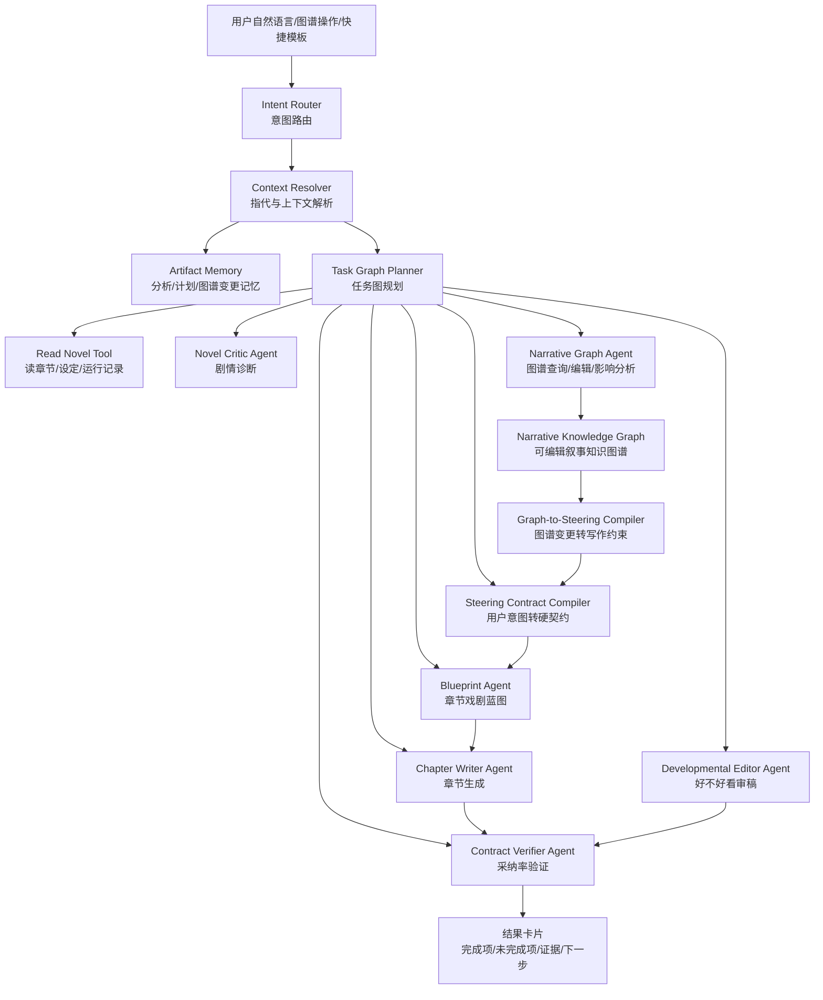
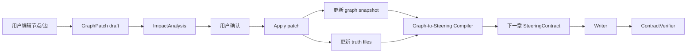
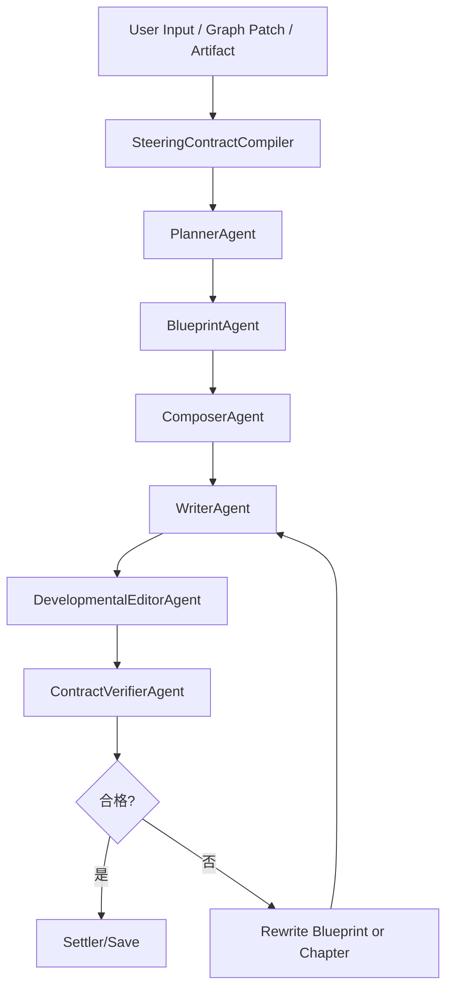

# NovelOS 顶级创作 Agent 与叙事知识图谱升级总设计

## 1. 文档定位

本文档是面向 OpenClaw coding agents 的总设计与实施蓝图。目标不是再做一个普通的 AI 写作按钮，而是把 InkOS 升级成一个真正能让作者掌控故事的小说创作操作系统。

本文档覆盖：

1. 当前系统的真实痛点与根因。
2. AI 助手从 regex 动作识别升级为 Agentic Orchestrator 的完整设计。
3. 知识图谱从展示面板升级为可编辑、可验证、可影响剧情的 Narrative Knowledge Graph。
4. 工具/函数/数据模型/API/UI 的实施路线。
5. 评测标准、验收标准、失败回滚与商业卖点。

本文档面向：

1. OpenClaw coding agents。
2. 项目 owner。
3. 后续负责 Studio/Core Pipeline/Agent orchestration 的工程师。

模型假设：

1. coding agents 使用 `mimo-v2-pro · xiaomi`。
2. 项目继续保持 local-first，不依赖外部云端状态。
3. 保留现有 InkOS 架构，不推倒重写。

相关现有文档：

1. [17-顶级小说创作智能体设计与实现方案.md](./17-顶级小说创作智能体设计与实现方案.md)
2. [18-AI助手NovelOS实施级详细设计与Agent执行蓝图.md](./18-AI助手NovelOS实施级详细设计与Agent执行蓝图.md)
3. [19-NovelOS全流程派发Issue包-面向Copilot-Agents.md](./19-NovelOS全流程派发Issue包-面向Copilot-Agents.md)

---

## 2. 一句话愿景

InkOS NovelOS 不是“AI 替你续写小说”，而是“可编辑剧情因果网络的 AI 小说创作系统”。

用户不再靠不断写 prompt 祈祷 AI 听话，而是在剧情驾驶舱中直接操控人物欲望、关系、冲突、伏笔、秘密和世界规则。AI 的职责是把这些结构转成有张力的章节，并用证据证明它采纳了用户意图。

商业表达：

> NovelOS 是面向严肃网文作者和 AI 创作团队的剧情操作系统。它把小说从一次性 prompt 生成，升级为可规划、可编辑、可审计、可回滚、可持续连载的创作工作流。

---

## 3. 当前痛点与根因

### 3.1 AI 助手意图识别弱

现象：

1. 用户问“目前剧情写得如何”，系统能给出分析。
2. 用户接着说“按照你给的优缺点规划一下下一章”，系统无法稳定理解。
3. 用户明确说“下一章必须发生某个剧情”，系统经常只部分采纳，甚至完全忽略。

根因：

1. 当前 Assistant 意图识别主要依赖 regex。
2. 系统没有把上一轮 LLM 生成的分析保存为可引用 artifact。
3. “你刚才说的”“按第二条建议”“照这个方向写”这类指代没有解析层。
4. Assistant 缺少专用工具来把自然语言建议编译成结构化写作契约。
5. Writer 最终是否采纳用户意图缺少自动验证。

相关代码入口：

1. `packages/studio/src/pages/AssistantView.tsx`
2. `packages/studio/src/api/server.ts`
3. `packages/studio/src/api/services/assistant-conductor.ts`
4. `packages/studio/src/api/services/assistant-command-parser.ts`
5. `packages/studio/src/api/services/write-next-service.ts`
6. `packages/core/src/agents/planner.ts`
7. `packages/core/src/agents/writer.ts`

### 3.2 当前工具偏执行，缺少创作决策工具

已有工具更像：

1. 写下一章。
2. 审计章节。
3. 修订章节。
4. 查询章节或真相文件。

缺少的关键工具：

1. 读完整作品并分析当前剧情质量。
2. 把剧情分析转成下一章策略。
3. 把用户建议转成硬约束。
4. 验证正文是否满足用户建议。
5. 编辑知识图谱并生成剧情影响分析。
6. 将图谱变更编译成下一章 contract/blueprint。

### 3.3 知识图谱目前是展示型面板

现象：

1. 图谱能展示人物、章节、伏笔、规则等节点。
2. 前端有“变更队列”的 UI 概念。
3. 但用户操作图谱后，不会真正改写 truth files。
4. 图谱变更不会进入 Planner/Writer。
5. 图谱无法反向影响剧情走向。

根因：

1. `story-graph-service.ts` 当前主要从 truth files 抽取展示节点。
2. `StoryGraphView.tsx` 的 proposal queue 是前端本地状态，不是后端持久化变更模型。
3. 缺少 `GraphPatch`、`ImpactAnalysis`、`Graph-to-Steering Compiler`。
4. 缺少图谱变更与故事线崩坏风险的验证。

### 3.4 小说质量差的系统性原因

当前系统比较像“连续性维护器”，不是“爆款章节导演”。

它重视：

1. 状态延续。
2. 设定一致。
3. 禁止破坏规则。
4. AI 痕迹规避。

但缺少强制生成：

1. 本章具体冲突。
2. 主角主动选择。
3. 代价。
4. 反转。
5. 爽点兑现。
6. 章尾钩子。
7. 读者期待管理。
8. 用户意图采纳验证。

所以成稿容易变成：

1. 发现线索。
2. 冷静分析。
3. 记录状态。
4. 暂不行动。
5. 留待后续。

这就是“流水账感”的工程根因。

---

## 4. 目标架构总图



---

## 5. AI 助手升级设计

### 5.1 核心原则

1. 不再让 regex 决定复杂意图。
2. 不再让 LLM 回复只停留在聊天文本。
3. 任何重要分析都必须保存为 artifact。
4. 任何写作建议都必须编译为 `ChapterSteeringContract`。
5. 任何章节生成都必须验证用户契约采纳率。
6. 用户永远能看见系统“理解了什么、准备怎么写、写完采纳了什么”。

### 5.2 新增 Agent Team

#### 5.2.1 IntentRouterAgent

职责：

1. 判断用户当前意图。
2. 识别单步任务、复合任务、承接任务、图谱操作。
3. 给出风险等级和是否需要澄清。

输入：

```ts
interface IntentRouterInput {
  sessionId: string;
  userText: string;
  selectedBookIds: string[];
  activeBookId?: string;
  recentMessages: Array<{ role: "user" | "assistant"; content: string }>;
  recentArtifacts: AssistantArtifactSummary[];
  currentPage?: string;
}
```

输出：

```ts
type AssistantIntentType =
  | "ask_plot_quality"
  | "plan_next_from_previous_analysis"
  | "write_next_with_user_plot"
  | "write_next_from_graph_change"
  | "critique_and_rewrite"
  | "query_story_graph"
  | "edit_story_graph"
  | "audit_chapter"
  | "revise_chapter"
  | "read_story_facts"
  | "clarify";

interface IntentRouterOutput {
  intentType: AssistantIntentType;
  confidence: number;
  referencedArtifactIds: string[];
  targetBookIds: string[];
  riskLevel: "low" | "medium" | "high";
  clarificationQuestion?: string;
  rationale: string;
}
```

关键验收：

1. “按照你刚才说的优缺点规划下一章”必须识别为 `plan_next_from_previous_analysis`。
2. “就按第二条建议写”必须解析到上一条分析 artifact 的第二条建议。
3. “把林清雪和万凡关系改成主动试探”必须识别为 `edit_story_graph`。

#### 5.2.2 ContextResolverAgent

职责：

1. 解析指代。
2. 找到上轮分析、上轮蓝图、最近图谱变更。
3. 将自然语言中的剧情要求抽取为候选约束。

输出：

```ts
interface ResolvedAssistantContext {
  resolvedReferences: Array<{
    phrase: string;
    artifactId: string;
    fieldPath?: string;
    confidence: number;
  }>;
  extractedUserRequirements: {
    goals: string[];
    mustInclude: string[];
    mustAvoid: string[];
    desiredTone: string[];
    desiredPace?: string;
    characterFocus: string[];
    payoffRequests: string[];
    endingHookRequests: string[];
  };
  missingInformation: string[];
}
```

#### 5.2.3 NovelCriticAgent

职责：

1. 阅读当前章节、章节摘要、truth files、运行记录。
2. 给出剧情优缺点。
3. 产出下一章机会，而不是泛泛评价。

输出：

```ts
interface PlotCritiqueArtifact {
  artifactId: string;
  type: "plot_critique";
  bookId: string;
  chapterRange: { from: number; to: number };
  strengths: string[];
  weaknesses: string[];
  stalePatterns: string[];
  readerPromises: string[];
  missedPayoffs: string[];
  nextChapterOpportunities: Array<{
    title: string;
    why: string;
    mustInclude: string[];
    risk: string;
    payoff: string;
  }>;
  evidence: Array<{ source: string; excerpt: string; reason: string }>;
}
```

关键要求：

1. Critique 不只说“节奏慢”，必须指出来自哪几章、哪种重复桥段。
2. 每个弱点必须给一个可执行的下一章修复机会。
3. artifact 必须可被下一轮引用。

#### 5.2.4 SteeringContractCompilerAgent

职责：

1. 把用户意图、剧情分析、图谱变更合并成硬契约。
2. 输出可直接传给 `write-next` 的结构化输入。

输出：

```ts
interface ChapterSteeringContract {
  goal?: string;
  mustInclude: string[];
  mustAvoid: string[];
  sceneBeats: string[];
  payoffRequired?: string;
  endingHook?: string;
  priority: "soft" | "normal" | "hard";
  sourceArtifactIds: string[];
  rawRequest: string;
}
```

规则：

1. 用户明确说“必须”，进入 `mustInclude`，priority 至少为 `hard`。
2. 用户说“不要”，进入 `mustAvoid`。
3. 来自 Critic 的建议进入 `sceneBeats` 或 `payoffRequired`。
4. 来自图谱变更的要求进入 `mustInclude`，并带 `sourceArtifactIds`。

#### 5.2.5 BlueprintAgent

职责：

1. 基于 `ChapterSteeringContract` 生成章节戏剧蓝图。
2. 每章必须有冲突、主动选择、代价、爽点、钩子。

输出：

```ts
interface ChapterBlueprint {
  openingHook: string;
  scenes: Array<{
    beat: string;
    pov?: string;
    location?: string;
    conflict: string;
    informationGap: string;
    turn: string;
    payoff: string;
    cost: string;
  }>;
  emotionalCurve: Array<{
    phase: "hook" | "pressure" | "choice" | "reversal" | "payoff" | "hook_out";
    intensity: number;
    note: string;
  }>;
  contractSatisfactionPlan: string[];
  endingHook: string;
}
```

#### 5.2.6 DevelopmentalEditorAgent

职责：

1. 不只检查错没错，而是判断好不好看。
2. 识别流水账、无冲突、主角被动、爽点虚化、情绪平、缺反转。

评分维度：

1. 冲突强度。
2. 主角主动性。
3. 爽点兑现。
4. 角色关系推进。
5. 读者钩子。
6. 语言鲜活度。
7. 用户契约满足率。

输出：

```ts
interface DevelopmentalEditReport {
  overallScore: number;
  dimensions: {
    conflict: number;
    agency: number;
    payoff: number;
    relationshipMovement: number;
    hook: number;
    proseFreshness: number;
    contractSatisfaction: number;
  };
  blockingIssues: string[];
  rewriteAdvice: string[];
  evidence: Array<{ source: string; excerpt: string; reason: string }>;
}
```

#### 5.2.7 ContractVerifierAgent

职责：

1. 对照 `ChapterSteeringContract` 检查正文。
2. 输出逐项完成状态。
3. 低于阈值则阻止自动保存或触发重写。

输出：

```ts
interface ContractVerificationReport {
  satisfactionRate: number;
  items: Array<{
    requirement: string;
    status: "satisfied" | "partial" | "missing";
    evidence?: string;
    reason: string;
  }>;
  shouldRewrite: boolean;
}
```

验收：

1. 用户 mustInclude 采纳率必须 100%。
2. 若未满足，系统必须明确展示未满足项，不能假装完成。

---

## 6. Assistant Artifact Memory 设计

### 6.1 为什么必须有 Artifact

当前系统最大的问题之一是：LLM 的上一轮高质量分析只存在于聊天文本里。用户下一轮引用“你刚才说的”，系统没有稳定对象可解析。

Artifact Memory 要解决：

1. 让分析结果可引用。
2. 让计划可复用。
3. 让图谱变更可追踪。
4. 让用户意图从聊天文本升级为系统状态。

### 6.2 数据模型

```ts
type AssistantArtifactType =
  | "plot_critique"
  | "chapter_plan"
  | "chapter_steering_contract"
  | "chapter_blueprint"
  | "story_graph_patch"
  | "impact_analysis"
  | "quality_report"
  | "contract_verification";

interface AssistantArtifact {
  artifactId: string;
  sessionId: string;
  bookId?: string;
  type: AssistantArtifactType;
  title: string;
  createdAt: string;
  sourceMessageIds: string[];
  payload: Record<string, unknown>;
  summary: string;
  searchableText: string;
}
```

### 6.3 存储建议

本地文件优先：

1. `.inkos/assistant-artifacts/{sessionId}.jsonl`
2. `books/{bookId}/runtime/assistant-artifacts.jsonl`

查询索引：

1. 最近 20 条 artifact 直接读 JSONL。
2. 后续可加入轻量 embedding 或关键词索引。

### 6.4 必须支持的引用模式

1. “按你刚才说的”
2. “按第二条建议”
3. “用刚才那个方案”
4. “不要用上次那个反转”
5. “把图谱里那条关系变化写进下一章”

---

## 7. 工具/函数设计

所有工具必须遵循 ACI 原则：

1. 输入结构化。
2. 输出可追踪。
3. 失败有错误码。
4. 每次调用产生日志事件。
5. 重要结果保存 artifact。

### 7.1 读与诊断工具

```ts
readNovelContext({
  bookId,
  chapterRange,
  includeTruthFiles,
  includeRuntime,
  maxChars
})
```

输出：

1. 章节摘要。
2. 最新章节片段。
3. story_bible/current_state/pending_hooks/character_matrix。
4. 最近运行记录。

```ts
critiqueCurrentPlot({
  bookId,
  chapterRange,
  focus
})
```

输出 `PlotCritiqueArtifact`，并保存 artifact。

### 7.2 意图与上下文工具

```ts
routeAssistantIntent({
  sessionId,
  userText,
  scope,
  recentMessages,
  recentArtifacts
})
```

```ts
resolveArtifactReference({
  sessionId,
  userText,
  candidateArtifactTypes,
  bookId
})
```

### 7.3 写作契约工具

```ts
compileSteeringContract({
  userText,
  resolvedContext,
  critiqueArtifacts,
  graphPatchArtifacts,
  existingPrefs
})
```

```ts
previewNextChapterBlueprint({
  bookId,
  steeringContract,
  graphContext
})
```

```ts
writeNextWithContract({
  bookId,
  mode,
  steeringContract,
  blueprint,
  parallelCandidates
})
```

```ts
verifyContractSatisfaction({
  chapterText,
  steeringContract,
  blueprint
})
```

### 7.4 图谱工具

```ts
queryNarrativeGraph({
  bookId,
  query,
  filters
})
```

```ts
proposeGraphChange({
  bookId,
  operations,
  reason,
  source
})
```

```ts
analyzeGraphChangeImpact({
  bookId,
  operations
})
```

```ts
applyGraphChange({
  bookId,
  changeId,
  approvedBy
})
```

```ts
rollbackGraphChange({
  bookId,
  changeId
})
```

```ts
compileGraphPatchToSteering({
  bookId,
  graphPatchId,
  nextChapterNumber
})
```

### 7.5 质量工具

```ts
evaluateChapterDrama({
  bookId,
  chapterNumber,
  chapterText,
  steeringContract,
  blueprint
})
```

```ts
selectBestCandidate({
  candidates,
  scoringWeights,
  steeringContract
})
```

---

## 8. Narrative Knowledge Graph 设计

### 8.1 当前 StoryGraph 的局限

当前图谱更像“story files 可视化”：

1. 节点类型少。
2. 边类型偏静态。
3. 缺少编辑事务。
4. 缺少影响分析。
5. 缺少写作链路输入。

目标是升级为 Narrative Knowledge Graph：它不只是展示故事，而是控制故事。

### 8.2 新节点类型

```ts
type NarrativeNodeType =
  | "book"
  | "volume"
  | "chapter"
  | "scene"
  | "character"
  | "desire"
  | "fear"
  | "secret"
  | "relationship"
  | "conflict"
  | "hook"
  | "promise"
  | "payoff"
  | "rule"
  | "resource"
  | "timeline_event"
  | "scene_beat"
  | "theme"
  | "constraint";
```

### 8.3 新边类型

```ts
type NarrativeEdgeType =
  | "contains"
  | "appears_in"
  | "wants"
  | "fears"
  | "hides"
  | "knows"
  | "blocks"
  | "helps"
  | "protects"
  | "betrays"
  | "owes"
  | "loves"
  | "hates"
  | "tests"
  | "misjudges"
  | "foreshadows"
  | "pays_off"
  | "contradicts"
  | "causes"
  | "depends_on"
  | "transforms_into"
  | "raises_stakes_for";
```

### 8.4 节点数据结构

```ts
interface NarrativeGraphNode {
  id: string;
  type: NarrativeNodeType;
  label: string;
  summary?: string;
  status?: "active" | "resolved" | "dormant" | "deprecated";
  confidence: number;
  weight: number;
  tags: string[];
  evidence: Array<{
    source: string;
    excerpt: string;
    locator?: string;
  }>;
  userEditable: boolean;
  locked?: boolean;
  metadata: Record<string, unknown>;
}
```

### 8.5 边数据结构

```ts
interface NarrativeGraphEdge {
  id: string;
  source: string;
  target: string;
  type: NarrativeEdgeType;
  label: string;
  strength: number;
  status?: "active" | "resolved" | "planned" | "deprecated";
  evidence: Array<{
    source: string;
    excerpt: string;
    locator?: string;
  }>;
  metadata: Record<string, unknown>;
}
```

### 8.6 GraphPatch 数据结构

任何用户编辑都不能直接修改图谱，必须先生成 patch。

```ts
interface NarrativeGraphPatch {
  patchId: string;
  bookId: string;
  createdAt: string;
  createdBy: "user" | "assistant";
  status: "draft" | "impact_analyzed" | "approved" | "applied" | "rejected" | "rolled_back";
  reason: string;
  operations: NarrativeGraphOperation[];
  impactAnalysis?: NarrativeGraphImpactAnalysis;
  appliedAt?: string;
  rollbackOf?: string;
}

type NarrativeGraphOperation =
  | { type: "add_node"; node: NarrativeGraphNode }
  | { type: "update_node"; nodeId: string; patch: Partial<NarrativeGraphNode> }
  | { type: "remove_node"; nodeId: string }
  | { type: "add_edge"; edge: NarrativeGraphEdge }
  | { type: "update_edge"; edgeId: string; patch: Partial<NarrativeGraphEdge> }
  | { type: "remove_edge"; edgeId: string };
```

### 8.7 影响分析

```ts
interface NarrativeGraphImpactAnalysis {
  riskLevel: "low" | "medium" | "high" | "critical";
  affectedCharacters: string[];
  affectedHooks: string[];
  affectedRules: string[];
  affectedChapters: number[];
  contradictions: Array<{
    description: string;
    evidence: string;
    severity: "low" | "medium" | "high";
  }>;
  requiredStoryPatches: string[];
  nextChapterSteeringHints: {
    mustInclude: string[];
    mustAvoid: string[];
    sceneBeats: string[];
    payoffRequired?: string;
    endingHook?: string;
  };
  recommendation: "safe_to_apply" | "apply_with_warning" | "requires_rewrite_plan" | "reject";
}
```

### 8.8 图谱变更如何影响剧情



例子：

用户把“林清雪 -> 万凡”的关系改为“主动试探合作”。

系统生成：

1. 更新 relationship edge。
2. 新增 conflict：林清雪误判万凡动机。
3. 新增 scene beat：林清雪主动找万凡。
4. 新增 hook：误判证据来源后续反转。
5. 下一章 contract：
   - `mustInclude: ["林清雪主动找万凡", "林清雪发生一次误判", "万凡获得局部主动权"]`
   - `mustAvoid: ["林清雪无理由完全信任万凡"]`
   - `payoffRequired: "万凡用信息差反制一次试探"`

---

## 9. Studio 产品体验设计

### 9.1 Assistant 页面

新增卡片：

1. 意图理解卡：显示系统理解了什么。
2. 引用来源卡：显示“按你刚才说的”引用了哪份 artifact。
3. 下一章契约卡：显示 goal/mustInclude/mustAvoid/payoff/endingHook。
4. 蓝图预览卡：显示 5-8 个场景节拍。
5. 采纳率验证卡：写完后显示每条要求是否完成。

用户路径：

1. 用户：目前剧情写得如何？
2. 系统：读取章节，输出 CritiqueArtifact。
3. 用户：按照你说的优缺点规划下一章。
4. 系统：引用 CritiqueArtifact，生成 Contract + Blueprint。
5. 用户：确认/编辑。
6. 系统：写下一章。
7. 系统：展示 ContractVerificationReport。

### 9.2 剧情驾驶舱

StoryGraphView 应升级为 Narrative Cockpit。

页面布局：

1. 左侧：图层与过滤器。
2. 中间：可编辑图谱画布。
3. 右侧：节点详情、证据、可执行动作。
4. 下方：Story Patch Queue。
5. 顶部：影响分析、应用变更、生成下一章。

核心图层：

1. 人物关系。
2. 欲望/恐惧/秘密。
3. 冲突网络。
4. 伏笔债务。
5. 读者期待。
6. 时间线。
7. 世界规则。
8. 未来剧情沙盘。

### 9.3 图谱动作

每个节点/边都应该提供动作：

1. 写进下一章。
2. 提前兑现。
3. 延后兑现。
4. 强化冲突。
5. 改变关系。
6. 添加秘密。
7. 标记为禁止破坏。
8. 生成 3 条未来路线。

---

## 10. API 设计

### 10.1 Assistant Artifact API

```http
GET /api/assistant/artifacts?sessionId=...&bookId=...&type=...
POST /api/assistant/artifacts
GET /api/assistant/artifacts/:artifactId
```

### 10.2 Assistant Intent API

```http
POST /api/assistant/intent/route
POST /api/assistant/context/resolve
```

### 10.3 Plot Critique API

```http
POST /api/books/:id/plot-critique
```

输入：

```json
{
  "chapterRange": { "from": 1, "to": 8 },
  "focus": "当前剧情优缺点与下一章机会"
}
```

输出：

```json
{
  "artifact": {
    "type": "plot_critique",
    "payload": {}
  }
}
```

### 10.4 Steering API

```http
POST /api/books/:id/steering/compile
POST /api/books/:id/blueprint/preview
POST /api/books/:id/contract/verify
```

### 10.5 Narrative Graph API

```http
GET /api/books/:id/narrative-graph
POST /api/books/:id/narrative-graph/query
POST /api/books/:id/narrative-graph/patches
POST /api/books/:id/narrative-graph/patches/:patchId/impact
POST /api/books/:id/narrative-graph/patches/:patchId/apply
POST /api/books/:id/narrative-graph/patches/:patchId/rollback
POST /api/books/:id/narrative-graph/patches/:patchId/compile-steering
```

---

## 11. Core Pipeline 升级

### 11.1 新链路



### 11.2 Writer Prompt 必须强化

Writer 生成前必须看到：

1. `Steering Contract`
2. `Chapter Blueprint`
3. `Narrative Graph Constraints`
4. `Reader Promises`
5. `Must Include`
6. `Must Avoid`

Writer 输出前必须自检：

1. 用户要求是否逐条满足。
2. 本章冲突是什么。
3. 主角做了什么主动选择。
4. 代价是什么。
5. 爽点在哪里兑现。
6. 章尾钩子是什么。

### 11.3 多候选竞争

关键章节支持 2-3 个候选：

评分维度：

1. 用户契约满足率，权重 30%。
2. 冲突强度，权重 15%。
3. 主角主动性，权重 15%。
4. 爽点兑现，权重 15%。
5. 角色关系推进，权重 10%。
6. 读者钩子，权重 10%。
7. 语言鲜活度，权重 5%。

低成本策略：

1. 默认单候选。
2. 用户开启“高质量模式”或章节关键程度高时多候选。
3. 图谱变更为 high risk 时，必须先蓝图多候选，不直接正文多候选。

---

## 12. 技术实施路线

### P0：修复意图与 artifact 闭环

目标：

1. 支持“按你刚才说的”。
2. 分析结果可引用。
3. 用户建议可编译为 contract。

任务：

1. 新增 `assistant-artifact-service.ts`。
2. 新增 `intent-router-service.ts`。
3. 新增 `context-resolver-service.ts`。
4. 新增 `plot-critique-service.ts`。
5. Assistant 对话里的剧情分析结果必须保存 artifact。
6. `/assistant/plan` 使用 intent router，而不是只靠 regex。

验收：

1. 用户问剧情质量，生成 `plot_critique` artifact。
2. 用户说“按你刚才说的规划下一章”，返回包含 sourceArtifactIds 的 contract。
3. 单测覆盖指代解析。

### P1：Steering Contract 与 Blueprint 产品化

目标：

1. 下一章计划可预览。
2. 用户建议成为硬约束。
3. Writer 必须按蓝图写。

任务：

1. 新增 `/steering/compile`。
2. 新增 `/blueprint/preview`。
3. 升级 `write-next`：支持 `steeringContract + blueprint`。
4. Studio 新增 ContractCard 与 BlueprintPreviewCard。
5. Runtime artifact 输出 contract/blueprint。

验收：

1. 用户输入 mustInclude，runtime intent 中必须可见。
2. 蓝图必须包含至少 5 个 scene beats。
3. 写完后正文必须能找到 mustInclude 证据。

### P2：Narrative Graph 后端化

目标：

1. 图谱变更不再只是前端 proposal。
2. 后端支持 patch、impact、apply、rollback。

任务：

1. 新增 `narrative-graph-service.ts`。
2. 新增 `narrative-graph-patch-service.ts`。
3. 存储 `books/{bookId}/story/narrative_graph.json`。
4. 存储 `books/{bookId}/runtime/narrative_graph_patches.jsonl`。
5. 从旧 story graph 自动迁移/派生。

验收：

1. 图谱节点编辑能生成 patch。
2. patch 有影响分析。
3. patch apply 后持久化。
4. rollback 后恢复。

### P3：Graph-to-Steering Compiler

目标：

1. 用户编辑图谱能实打实影响下一章。

任务：

1. 新增 `graph-to-steering-compiler.ts`。
2. patch apply 后生成 steering hints。
3. `/write-next` 自动读取未消费的 high priority graph patch。
4. 写完后标记 patch consumed 或 partially consumed。

验收：

1. 用户修改关系边，下一章 contract 必须包含对应要求。
2. Writer 正文必须体现图谱变更。
3. ContractVerifier 必须验证 graph patch 采纳情况。

### P4：剧情驾驶舱 UI

目标：

1. StoryGraphView 升级为可编辑 Narrative Cockpit。
2. 用户可直接操控故事线。

任务：

1. 节点编辑面板。
2. 边编辑面板。
3. Patch Queue。
4. Impact Analysis Drawer。
5. Generate Next From Graph 按钮。
6. Future Routes 沙盘卡片。

验收：

1. 用户能编辑人物关系。
2. 用户能新增伏笔。
3. 用户能将一个伏笔标记为“下一章兑现”。
4. UI 显示风险与影响。
5. 确认后影响下一章写作。

### P5：质量闭环与候选竞争

目标：

1. 系统不只是写完，而是判断好不好看。
2. 低质量不能无声保存。

任务：

1. 新增 DevelopmentalEditorAgent。
2. 新增 ContractVerifierAgent。
3. 多候选评分与选优。
4. 结果卡展示采纳率和编辑评分。

验收：

1. mustInclude 采纳率低于 100% 时阻止自动成功。
2. 冲突/主动性/爽点评分低于阈值时触发 rewrite。
3. 用户能看到每条要求的完成证据。

---

## 13. 评测标准

### 13.1 意图识别评测

测试集至少包含：

1. 显性写作：请写下一章。
2. 剧情要求：下一章让林清雪主动找万凡。
3. 指代承接：按你刚才说的优缺点规划下一章。
4. 部分引用：按第二条建议写。
5. 图谱编辑：把两人的关系改成互相试探。
6. 查询：现在有哪些未回收伏笔？
7. 复合任务：先分析最近三章，再规划下一章。

指标：

1. Intent accuracy >= 95%。
2. Reference resolution accuracy >= 90%。
3. Clarification precision >= 90%，即只在必要时追问。

### 13.2 用户契约采纳评测

样例：

用户要求：

1. 林清雪主动找万凡。
2. 出现一次误判反转。
3. 万凡不能被动等待。
4. 章尾留下系统异常钩子。

指标：

1. mustInclude satisfaction = 100%。
2. mustAvoid violation = 0。
3. evidence coverage = 100%，每条要求都有正文证据。

### 13.3 小说质量评测

维度：

1. 冲突强度。
2. 主角主动性。
3. 爽点兑现。
4. 反转质量。
5. 角色关系推进。
6. 场景鲜活度。
7. 语言去流水账。
8. 章尾钩子。

阈值：

1. 单章综合 >= 80 才可默认保存。
2. 用户契约满足率必须 100%。
3. 冲突强度低于 70 触发蓝图重写。
4. 主角主动性低于 70 触发局部重写。

### 13.4 图谱有效性评测

指标：

1. 图谱编辑持久化成功率 >= 99%。
2. patch impact analysis 覆盖 affected characters/hooks/rules/chapters。
3. graph patch to steering 转换准确率 >= 90%。
4. 图谱变更在下一章正文体现率 >= 90%。
5. rollback 成功率 100%。

### 13.5 回归样本

首批固定回归书：

1. `神级红颜进化系统`
2. `新骆驼祥子-海归女王逆袭记`

每次升级后至少跑：

1. 当前剧情诊断。
2. 按诊断规划下一章。
3. 用户指定 mustInclude 写下一章。
4. 图谱编辑后写下一章。
5. 契约验证。

---

## 14. 验收标准

### 14.1 P0 验收

用户连续对话：

1. “目前剧情写得如何？”
2. “按照你给的优缺点规划下一章。”

系统必须：

1. 第一步生成 `plot_critique` artifact。
2. 第二步引用该 artifact。
3. 输出 `ChapterSteeringContract`。
4. 输出 `ChapterBlueprint`。
5. 不要求用户重复上一轮内容。

### 14.2 P1 验收

输入：

> 下一章必须让林清雪主动找万凡，并出现一次误判反转。不要让万凡被动等消息。

系统必须：

1. `mustInclude` 包含“林清雪主动找万凡”。
2. `mustInclude` 包含“误判反转”。
3. `mustAvoid` 包含“万凡被动等消息”。
4. 蓝图中有对应 scene beat。
5. 正文中有证据。
6. 验证报告显示全部 satisfied。

### 14.3 P2/P3 验收

用户在图谱中操作：

> 把林清雪对万凡的关系从怀疑改成主动试探合作。

系统必须：

1. 生成 graph patch。
2. 展示影响分析。
3. 用户确认后持久化。
4. 下一章 contract 自动包含关系变更要求。
5. 正文体现主动试探合作。
6. 写完后 patch 状态变为 consumed 或 partially consumed。

### 14.4 P4 验收

剧情驾驶舱必须支持：

1. 查看人物欲望/恐惧/秘密。
2. 编辑人物关系。
3. 新增伏笔。
4. 标记伏笔下一章兑现。
5. 生成影响分析。
6. 从图谱变更直接生成下一章。

### 14.5 P5 验收

系统必须：

1. 支持至少 2 个候选章节或蓝图。
2. 展示候选评分。
3. 自动选择或让用户选择。
4. 低质量候选不保存。
5. 输出质量报告和采纳率报告。

---

## 15. OpenClaw Agents 派工建议

### Agent A：Assistant Intent 与 Artifact

负责文件：

1. `packages/studio/src/api/services/assistant-artifact-service.ts`
2. `packages/studio/src/api/services/intent-router-service.ts`
3. `packages/studio/src/api/services/context-resolver-service.ts`
4. `packages/studio/src/api/server.ts`
5. `packages/studio/src/pages/AssistantView.tsx`

交付：

1. Artifact 存储。
2. Intent route API。
3. Context resolve API。
4. Assistant plan 使用新路由。
5. 单测和集成测试。

### Agent B：Plot Critique 与 Steering

负责文件：

1. `packages/studio/src/api/services/plot-critique-service.ts`
2. `packages/studio/src/api/services/steering-contract-service.ts`
3. `packages/studio/src/api/services/write-next-service.ts`
4. `packages/core/src/agents/planner.ts`
5. `packages/core/src/models/input-governance.ts`

交付：

1. 剧情诊断 artifact。
2. Steering compile。
3. Blueprint preview。
4. write-next contract 接入。

### Agent C：Narrative Graph Backend

负责文件：

1. `packages/studio/src/api/services/narrative-graph-service.ts`
2. `packages/studio/src/api/services/narrative-graph-patch-service.ts`
3. `packages/studio/src/api/services/story-graph-service.ts`
4. `packages/studio/src/api/server.ts`

交付：

1. 新图谱数据模型。
2. patch/impact/apply/rollback。
3. 旧 story graph 兼容。
4. API 测试。

### Agent D：Narrative Cockpit UI

负责文件：

1. `packages/studio/src/pages/StoryGraphView.tsx`
2. `packages/studio/src/components/narrative-graph/*`
3. `packages/studio/src/index.css`
4. `packages/studio/src/pages/story-graph-view.test.ts`

交付：

1. 图谱编辑 UI。
2. Patch Queue。
3. Impact Drawer。
4. Generate Next From Graph。

### Agent E：Quality Loop

负责文件：

1. `packages/core/src/agents/developmental-editor.ts`
2. `packages/core/src/agents/contract-verifier.ts`
3. `packages/core/src/pipeline/runner.ts`
4. `packages/studio/src/components/assistant/QualityReportCard.tsx`
5. `packages/studio/src/components/assistant/CandidateComparisonCard.tsx`

交付：

1. 编辑级质量评分。
2. 契约验证。
3. 候选评分。
4. 低质量自动重写策略。

### Agent F：E2E 与回归评测

负责文件：

1. `packages/core/src/__tests__/*`
2. `packages/studio/src/api/server.test.ts`
3. `packages/studio/src/pages/assistant-view.test.ts`
4. `packages/studio/src/pages/story-graph-view.test.ts`
5. `packages/studio/src/api/services/story-graph-service.test.ts`

交付：

1. 指代解析测试。
2. 用户契约采纳测试。
3. 图谱 patch 测试。
4. 两本回归样本的脚本。

---

## 16. 风险与控制

### 16.1 LLM 误判用户意图

控制：

1. confidence < 0.75 时展示澄清问题。
2. 高风险写作动作必须确认 contract。
3. 用户可编辑 contract。

### 16.2 图谱编辑导致故事崩坏

控制：

1. 所有图谱编辑先 patch，不直接 apply。
2. high/critical 风险必须二次确认。
3. 影响已写章节时提示“需要重写历史章节”。

### 16.3 成本上升

控制：

1. 默认单候选。
2. 多候选只用于关键章节、高风险图谱变更或用户开启高质量模式。
3. Artifact 和 critique 缓存。

### 16.4 UI 复杂度过高

控制：

1. 默认展示核心图层。
2. 高级图层折叠。
3. 用户动作以按钮和菜单为主，不要求用户理解所有图论概念。

---

## 17. 最终成功标准

NovelOS 升级成功，不看功能数量，看以下结果：

1. 用户说“按照你刚才的建议写”，系统能正确理解。
2. 用户写的具体剧情要求，最终章节 100% 采纳。
3. 用户编辑知识图谱，下一章真实体现该编辑。
4. 章节不再像流水账，而是有冲突、选择、代价、爽点、钩子。
5. 用户能看见 AI 为什么这么写，也能回滚或改方向。
6. 系统从“AI 续写工具”升级为“可控的小说创作操作系统”。

---

## 18. 第一批必须完成的垂直切片

建议 OpenClaw agents 不要一开始铺太大，先完成一个端到端切片：

### 切片 1：剧情诊断 -> 指代规划 -> 写下一章

流程：

1. 用户问“目前剧情写得如何？”
2. 系统生成 `plot_critique` artifact。
3. 用户说“按照你给的优缺点规划下一章。”
4. 系统生成 `steeringContract + blueprint`。
5. 用户确认。
6. 系统写下一章。
7. 系统验证采纳率。

这是最优先切片，因为它直接修复当前最痛的问题。

### 切片 2：图谱编辑 -> 影响分析 -> 下一章体现

流程：

1. 用户在图谱改一条人物关系。
2. 系统生成 patch。
3. 系统展示影响分析。
4. 用户确认。
5. 系统将 patch 编译成 steering contract。
6. 写下一章。
7. 验证正文体现图谱变更。

这是商业卖点切片，因为它能证明知识图谱不是摆设。

### 切片 3：候选评分 -> 选优保存

流程：

1. 用户开启高质量模式。
2. 系统生成 2 个蓝图或章节候选。
3. DevelopmentalEditorAgent 打分。
4. ContractVerifierAgent 验证。
5. 自动选优或用户选择。

这是质量跃迁切片。

